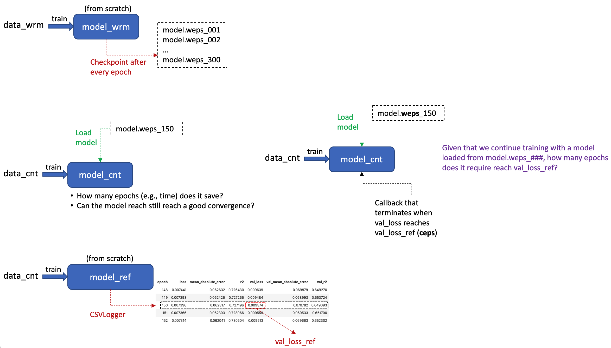

The use of cyclical learning rate (CLR) enables and accelerate transfer learning with cell line drug response dataset
and stringent data partitioning (e.g., disjoing set where train and test sets have no overlap on drugs and cell lines).

Schematic of the pipeline. 

Results showing the speedup when using a pre-trained model and transfer learning. 

